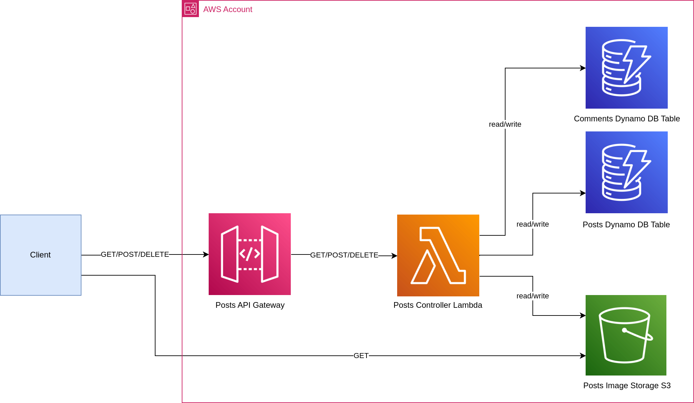

# Image Posts Serverless API

## Build Requirements

* AWS CLI - [Install the AWS CLI](https://aws.amazon.com/cli/)
* SAM
  CLI - [Install the SAM CLI](https://docs.aws.amazon.com/serverless-application-model/latest/developerguide/serverless-sam-cli-install.html)
* .NET Core 8 - [Install .NET Core](https://www.microsoft.com/net/download)
* Docker - [Install Docker community edition](https://hub.docker.com/search/?type=edition&offering=community)